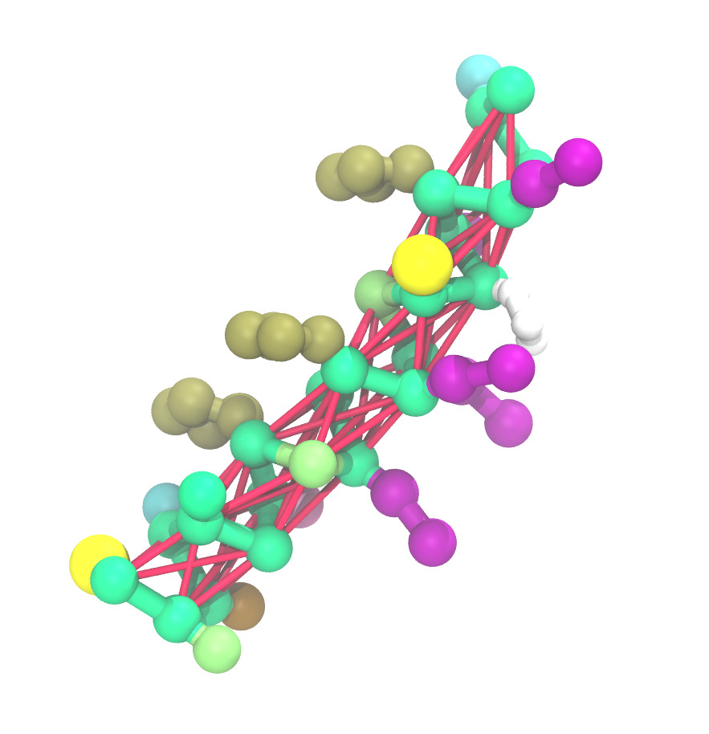

ENM
===============
Usage   
--------
.. parsed-literal::

    cg_spica ENM :strong:`CG_PDB` :strong:`CG_TOP` [:strong:`-maxr` :emphasis:`<float>`] [:strong:`-kENM` :emphasis:`<float>`] [:strong:`-pspica`]

Description
-----------
``ENM`` applies the elastic network model (ENM) to CG configuration and generates
topology files to prepare input files for running CG-MD with SPICA.
ENM requires values for cutoff length and force constants, 
specified with the ``-maxr`` and ``-kENM`` options, respectively. 
The default values are set to 9.0 A and 1.195 kcal/A2, and these values are ueed 
in the SPICA protein model (See the `protein SPICA`_ paper).

.. _protein SPICA: https://pubs.acs.org/doi/10.1021/acs.jctc.1c01207

Example
-------
``cg_spica ENM 2mag.cg.pdb 2mag.cg.top`` 

    
protein CG configuration (CPK) applied ENM (red)

:download:`2mag.cg.pdb <data/2mag.cg.pdb>` 
:download:`2mag.cg.top <data/2mag.cg.top>`  

Positional args
---------------

``CG_PDB`` [<.pdb>] 
    Input protein CG configuration
``CG_TOP`` [<.top>] 
    Output SPICA topology

Optional args
-------------

``-maxr`` <float> (9.0) [A]
    cutoff length for applying ENM
``-kENM`` <float> (1.195) [kcal/A2]
    force constant of harmonic potential for ENM
``-pspica`` (off)
    Assign partial charge (0.5590) for pSPICA FF (default: 0.1118, for SPICA FF)

