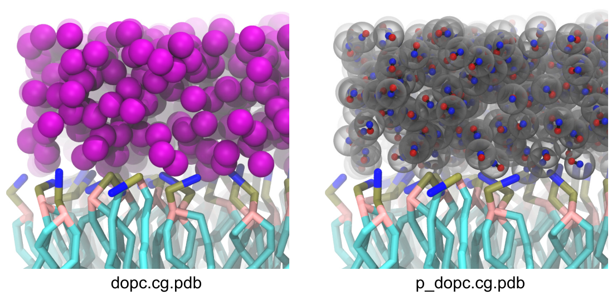

wat2polar      
===============
Usage   
--------
.. parsed-literal::

    cg_spica map2cg :strong:`SPICA_PDB` :strong:`pSPICA_PDB`

Description
-----------
``wat2polar`` converts SPICA CG water to pSPICA polar CG water.
SPICA CG ions are also converted to pSPICA's. This program recognizes
resname **WAT** or **TIP3** as SPICA CG water, and resname **SOD** and 
**CLA** as SPICA CG ions in PDB formatted CG configuration files.
The resname of SPICA water is converted to **PWAT** for pSPICA water.

The pSPICA water is created by randomly adding a site at 1.1 A 
away from the center of SPICA water without energy minimization.
The center and additional sites become the WO and WH segments of pSPICA 
water, respectively. 

Example
-------
``cg_spica map2cg dopc.cg.pdb p_dopc.cg.pdb`` 

:download:`dopc.cg.pdb <data/dopc.cg.pdb>` 
:download:`p_dopc.cg.pdb <data/p_dopc.cg.pdb>`  

Positional args
---------------

``SPICA_PDB`` [<.pdb>] 
    Input SPICA configuration
``pSPICA_PDB`` [<.pdb>] 
    Output pSPICA configuration after the above conversion

